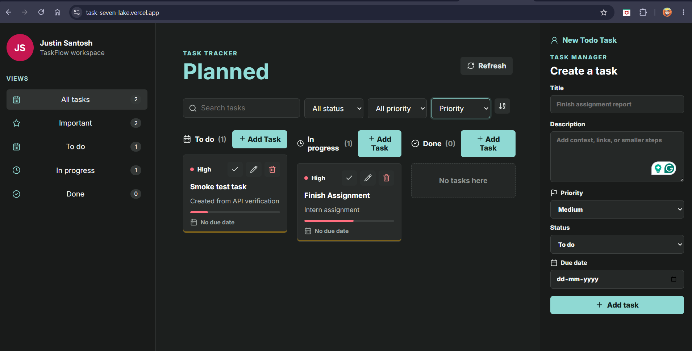

# TaskFlow - MERN Task Tracker

TaskFlow is a full-stack task tracker built with the MERN stack. It supports complete task CRUD, validation, filtering, sorting, status movement, MongoDB persistence, and dynamic React updates without page refresh.

## Live Demo

- Frontend: https://task-seven-lake.vercel.app
- Backend: https://taskflow-api-s36n.onrender.com
- Health Check: https://taskflow-api-s36n.onrender.com/health

## Preview



## Features

- Create, view, update, and delete tasks
- Move tasks across `To do`, `In progress`, and `Done`
- Search, filter, and sort tasks
- Frontend form validation
- Backend schema validation with Mongoose
- REST API with Express.js
- MongoDB Atlas integration
- Responsive professional UI
- Environment-based configuration

## Tech Stack

- Frontend: React.js, Vite, CSS, Lucide React
- Backend: Node.js, Express.js
- Database: MongoDB Atlas with Mongoose
- Deployment: Vercel frontend, Render backend

## Project Structure

```txt
backend/
  config/
  controllers/
  database/
  middlewares/
  models/
  routes/
  app.js

frontend/
  src/
    components/
    services/
    App.jsx
```

## Environment Variables

Backend `backend/.env.development.local`:

```env
PORT=5500
NODE_ENV=development
APP_NAME=TaskFlow API
CLIENT_URL=http://localhost:5173
DB_URI=your_mongodb_connection_string
```

Frontend `frontend/.env.local`:

```env
VITE_API_BASE_URL=http://localhost:5500/api/v1
```

Production backend:

```env
PORT=10000
NODE_ENV=production
APP_NAME=TaskFlow API
CLIENT_URL=https://task-seven-lake.vercel.app
DB_URI=your_mongodb_connection_string
```

Production frontend:

```env
VITE_API_BASE_URL=https://taskflow-api-s36n.onrender.com/api/v1
```

## Run Locally

Backend:

```bash
cd backend
npm install
npm run dev
```

Frontend:

```bash
cd frontend
npm install
npm run dev
```

Open:

```txt
http://localhost:5173
```

## API Routes

Base URL:

```txt
/api/v1/tasks
```

- `GET /tasks` - list tasks with optional `status`, `priority`, `search`, `sortBy`, and `order`
- `GET /tasks/:id` - get one task
- `POST /tasks` - create a task
- `PATCH /tasks/:id` - update a task
- `DELETE /tasks/:id` - delete a task

## Deployment

Backend is deployed on Render with:

```txt
Root Directory: backend
Build Command: npm install
Start Command: npm start
```

Frontend is deployed on Vercel with:

```txt
Root Directory: frontend
Build Command: npm run build
Output Directory: dist
```

